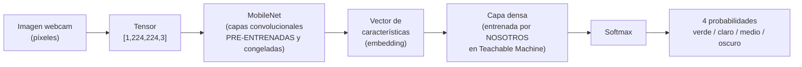

# Análisis técnico — ¿Qué ocurre dentro de la red?

Este documento profundiza en el funcionamiento interno del clasificador, más allá
de lo que se explica en el `README.md`. El objetivo es sustentar la sección de
**explicación técnica (25%)** de la evaluación.

---

## 1. De la imagen al tensor

Cuando la webcam captura un frame, el navegador tiene una imagen de píxeles.
Antes de que la red la procese, Teachable Machine la transforma:

1. **Redimensionado** a `224 × 224` píxeles (tamaño de entrada de MobileNet).
2. **Separación en 3 canales**: Rojo, Verde y Azul (RGB).
3. **Normalización**: cada valor de píxel (0–255) se escala al rango `[-1, 1]`
   o `[0, 1]` según la configuración del modelo base.

El resultado es un **tensor** de forma:

```
[1, 224, 224, 3]
 │    │    │   └── 3 canales de color (R, G, B)
 │    │    └────── ancho en píxeles
 │    └─────────── alto en píxeles
 └──────────────── tamaño del "batch" (1 imagen a la vez)
```

> 🔑 A partir de aquí, para la red **no existe "un grano de café"**: solo existe
> una matriz de números. Todo lo que sigue es álgebra lineal.

---

## 2. Forward Pass (paso hacia adelante)

El *forward pass* es el recorrido de los datos desde la entrada hasta la salida.



Diagrama equivalente en ASCII:

```
 [Imagen] -> [Tensor RGB] -> [ Convoluciones (MobileNet) ] -> [ Embedding ]
                                                                    |
                                                                    v
 [Probabilidades] <- [ Softmax ] <- [ Capa densa entrenada por nosotros ]
```

### 2.1 Capas convolucionales
Una **convolución** desliza pequeños filtros (kernels) sobre la imagen. Cada filtro
se activa ante un patrón concreto:

- Primeras capas: **bordes, líneas, cambios de color**.
- Capas intermedias: **texturas** (rugosidad del grano, grietas).
- Capas profundas: **combinaciones complejas** (forma+textura+color típicos de un grano tostado).

### 2.2 Funciones de activación
Tras cada capa se aplica una función no lineal (típicamente **ReLU**:
`f(x) = max(0, x)`). Sin estas no linealidades, la red entera colapsaría en una
simple multiplicación de matrices y no podría aprender patrones complejos.

---

## 3. ¿Qué es MobileNet y por qué lo usa Teachable Machine?

**MobileNet** es una red neuronal convolucional (CNN) **pre-entrenada** sobre
*ImageNet* (más de un millón de imágenes de 1000 categorías). Está diseñada para
ser ligera y rápida, ideal para correr en navegadores y móviles.

Teachable Machine **no entrena una red desde cero**. Usa MobileNet como
**extractor de características** ya sabio: sus capas convolucionales, tras ver
millones de imágenes, ya saben detectar bordes, texturas y formas genéricas.

---

## 4. Transfer Learning (aprendizaje por transferencia)

**Transfer learning** = reutilizar el conocimiento de un modelo entrenado en una
tarea grande para una tarea nueva y pequeña.

En nuestro caso:

| Parte de la red        | ¿Se entrena? | Rol                                                |
|------------------------|--------------|----------------------------------------------------|
| MobileNet (convoluciones) | ❌ Congelada | Extrae características genéricas (bordes, texturas).|
| Capa densa final       | ✅ Sí         | Aprende a mapear esas características a NUESTRAS 4 clases. |

**Por qué Teachable Machine lo usa:**
- Necesita **muy pocas imágenes** (30 por clase bastan) en lugar de miles.
- El entrenamiento tarda **segundos**, no horas.
- Funciona en el navegador, sin GPU dedicada.

La contrapartida: el modelo hereda los **sesgos y limitaciones** de MobileNet y
solo puede distinguir lo que las características genéricas permitan separar.

---

## 5. Cómo se calculan las probabilidades finales (Softmax)

La última capa densa produce un vector de **logits** (puntajes sin normalizar),
uno por clase. Por ejemplo:

```
logits = [ verde: 0.5, claro: 2.1, medio: 3.8, oscuro: 1.0 ]
```

La función **softmax** los convierte en probabilidades que suman 1:

```
softmax(z_i) = e^(z_i) / Σ_j e^(z_j)
```

Paso a paso con el ejemplo:

```
e^0.5 = 1.65     e^2.1 = 8.17     e^3.8 = 44.70     e^1.0 = 2.72
suma  = 1.65 + 8.17 + 44.70 + 2.72 = 57.24

verde  = 1.65 / 57.24 = 0.029  -> 2.9%
claro  = 8.17 / 57.24 = 0.143  -> 14.3%
medio  = 44.70 / 57.24 = 0.781 -> 78.1%   <- clase ganadora
oscuro = 2.72 / 57.24 = 0.048  -> 4.8%
```

- El exponencial **amplifica** las diferencias: el puntaje más alto se lleva la
  mayor parte de la probabilidad.
- La clase con mayor probabilidad es la predicción final (en la web, la barra
  resaltada).
- Que una clase tenga 78% **no significa "78% de certeza real"**: es una
  distribución relativa entre las opciones que la red conoce. Ante una imagen
  totalmente desconocida (una mano, una pared), la red igual repartirá el 100%
  entre las 4 clases, aunque ninguna sea correcta.

---

## 6. Pesos neuronales

Los **pesos** son los números que multiplican cada conexión de la red.
Durante el entrenamiento en Teachable Machine:

1. Se pasa una imagen por la red (forward pass).
2. Se compara la predicción con la etiqueta real (función de pérdida / *loss*).
3. Mediante **retropropagación (backpropagation)** y **descenso de gradiente**,
   se ajustan los pesos de la **capa densa** para reducir el error.
4. Se repite muchas veces (épocas) hasta que el error se estabiliza.

En transfer learning, solo se ajustan los pesos de la capa final; los de
MobileNet permanecen fijos.

---

## 7. Resumen conceptual

- La red convierte **píxeles → tensores → características → probabilidades**.
- No "reconoce café": encuentra **correlaciones estadísticas** entre patrones
  visuales (color, textura, brillo) y las etiquetas que le dimos.
- La calidad de esas correlaciones depende **directamente** de la calidad y
  variedad del dataset (ver `analisis_errores.md`).
